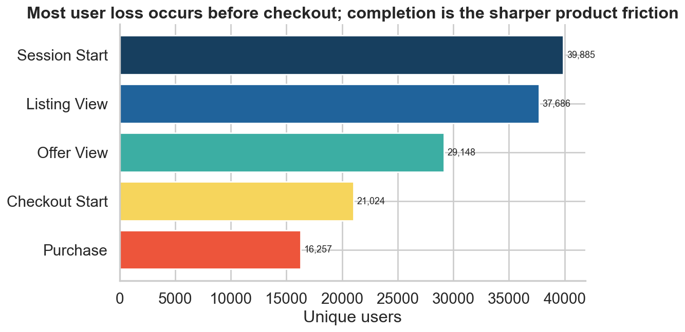
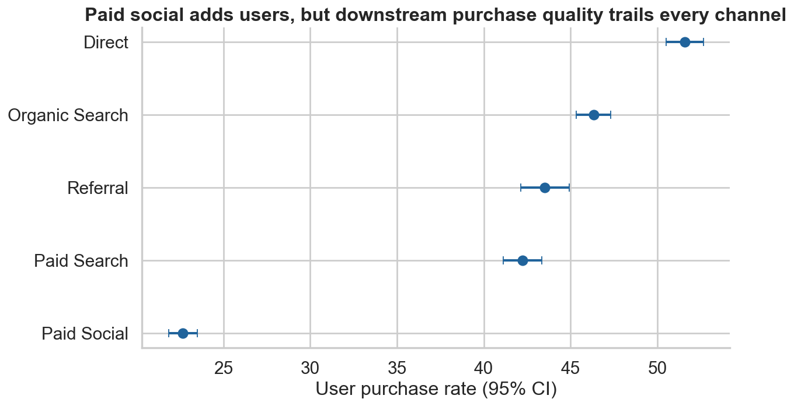
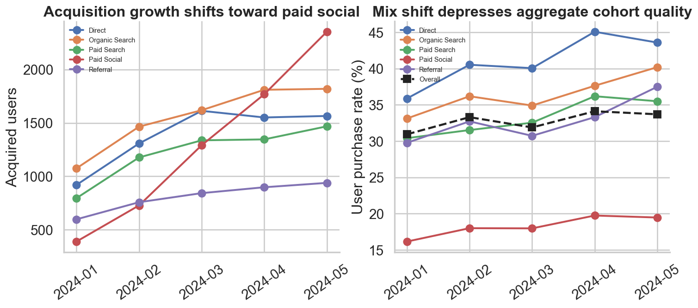
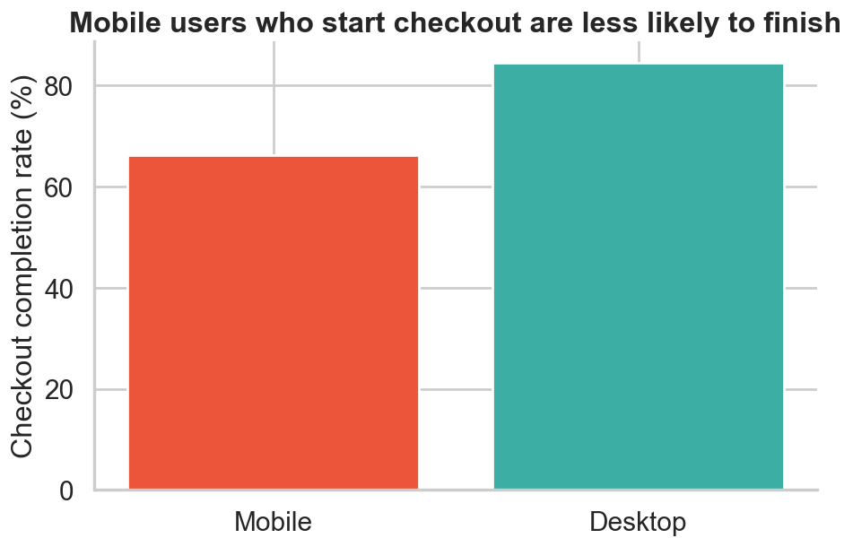
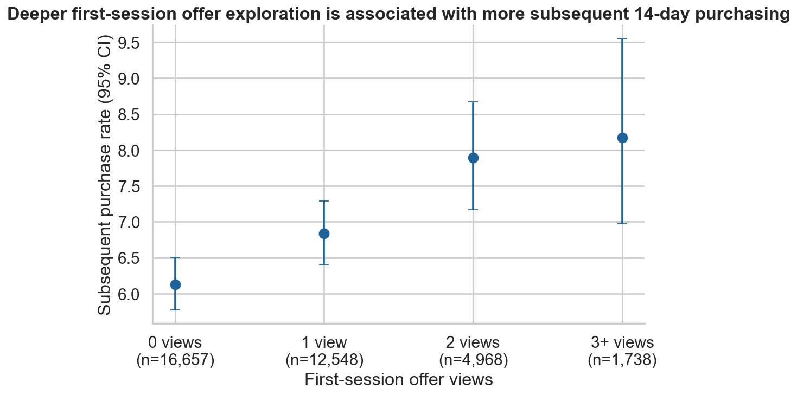

# Marketplace Funnel & Activation Analysis

## Executive summary

Marketplace acquisition grew, but downstream growth did not keep pace. Analysis of a six-month synthetic dataset (40,000 users, 468,253 events, and 25,472 orders) identifies two different problems hidden inside the topline trend.

First, acquisition mix shifted toward paid social. That channel supplied 9,603 users but converted 22.7% to purchase, compared with 51.6% for direct traffic. Its revenue per acquired user was £22.97. The aggregate conversion decline is therefore partly a composition effect—not evidence that every channel or the whole product deteriorated.

Second, users who reach checkout are materially less likely to finish on mobile: 66.2% session-level completion versus 84.4% on desktop. This is the clearest product-friction signal because it appears after users have expressed purchase intent. The evidence does not prove that the interface causes the gap; payment mix, context, and device performance remain plausible alternatives.

The recommended first action remains a mobile checkout diagnostic. In parallel, acquisition reviews should pair volume with 30-day purchase rate and revenue per acquired user. A maturity-controlled sensitivity analysis finds that subsequent 14-day purchasing rises gradually with first-session offer depth—from 6.1% at zero views to 8.2% at 3+ views. This supports deeper exploration as an early behavioral signal, but not `2+ views` as a uniquely validated activation threshold.



## Business question

Why is increased traffic not translating into proportional marketplace growth, and where should the product team intervene?

The investigation separates three possibilities: lower-quality acquisition, broad product deterioration, and localized funnel friction.

## Dataset

All data are synthetic and generated with a fixed seed. The results do not describe real marketplace users. The generator models acquisition, latent intent, sessions, exploration, checkout, purchase, and repeat behavior sequentially; its parameters remain visible in `src/generate_data.py`.

| Table | Grain | Rows | Selected fields |
|---|---:|---:|---|
| `users` | One row per acquired user | 40,000 | signup date, country, channel, device |
| `events` | One row per behavioral event | 468,253 | session, timestamp, event, listing, category |
| `orders` | One row per completed order | 25,472 | value, category, first-purchase flag |

The observation period is 1 January–30 June 2024.

## Metric definitions

| Metric | Definition | Why this denominator |
|---|---|---|
| User purchase rate | Unique purchasers / acquired users | Measures downstream acquisition quality without rewarding repeat orders |
| Exploration rate | Users with a listing or offer view / acquired users | Tests whether acquired users engage with supply |
| Checkout-start rate | Users starting checkout / acquired users | Captures purchase intent reached |
| Checkout completion | Purchasers / checkout starters | Isolates the post-checkout loss point |
| Revenue per acquired user | Revenue / acquired users | Connects channel volume and quality to value |
| 60-day repeat rate | Buyers with a second order within 60 days / first-time buyers with a full window | Avoids penalizing recent buyers with incomplete follow-up |
| Candidate early signal | First-session offer depth: 0, 1, 2, or 3+ views | Tested against purchases after that session and within a complete 14-day window |

The main funnel is non-strict and user-level: a user counts as reaching a stage if they reach it at least once. Session-level analysis is used where the question concerns checkout completion in a particular visit.

## Analytical approach

User-level metrics assess acquisition quality and funnel reach; session-level transitions isolate checkout friction; maturity-controlled cohorts support conversion and repeat-purchase comparisons. First-session offer depth is evaluated against purchases occurring after that session and within a complete 14-day window. SQL contains the funnel, cohort, retention, and segmentation queries; Python handles uncertainty, adjustment, visualization, and cross-checks. Further detail is in [methodology.md](docs/methodology.md).

## Key findings

### 1. Acquisition growth is increasingly concentrated in a lower-quality channel

Paid social contributes substantial volume but has the lowest downstream purchase rate. Its 22.7% user purchase rate is less than half direct traffic's 51.6%, and later cohorts contain a growing paid-social share.





The aggregate decline is partly a mix effect rather than broad deterioration within every channel. Acquisition reviews should include 30-day purchase rate and revenue per acquired user alongside volume. Paid social should not be reduced without spend, marginal CAC, and contribution-margin data.

### 2. Mobile checkout completion is the highest-priority product friction

The device gap widens after checkout begins: 66.2% of mobile checkout sessions complete versus 84.4% on desktop (p < 0.001).



The result prioritizes mobile checkout for diagnosis but does not identify the mechanism. Form complexity, payment coverage, performance, interruption, or unobserved user differences could contribute. The next step is step-level instrumentation, failure-reason and performance review, followed by a focused mobile experiment.

### 3. Deeper early exploration predicts later purchasing, without a unique threshold

Among 35,911 users with a complete follow-up window, purchase **after the first session and within 14 days of its start** rises from 6.1% (0 views; n=16,657) to 6.8% (1; n=12,548), 7.9% (2; n=4,968), and 8.2% (3+; n=1,738). First-session purchases do not count toward this outcome. Adjustment for channel, device, country, and signup month modestly weakens the contrast but preserves the ordering: odds ratios versus zero views are 1.10, 1.26, and 1.30.



The relationship is gradual, and rates for 2 and 3+ views overlap. `2+` remains a practical candidate segmentation, not a uniquely supported threshold or operational activation metric. Persistent latent intent can explain both exploration and later purchase, so the association supports a randomized decision-support test—not forced additional clicks or a causal claim.

### 4. Retention is meaningful, but not the first intervention point

Among first-time buyers with a complete 60-day follow-up window, 35.4% make a second purchase. This is useful as a guardrail and long-term outcome, but the largest actionable gap occurs before the first purchase.

## Recommended actions

1. **Diagnose mobile checkout first.** The 18.2-point completion gap occurs closest to value. Instrument step abandonment, payment failures, and performance, then test a focused change using completion per mobile checkout starter as the primary metric and order value, refunds, and payment failures as guardrails.
2. **Add acquisition-quality reporting.** Pair channel volume with 30-day purchase rate, revenue per acquired user, and—once spend is joined—contribution margin and marginal CAC. The current evidence is insufficient to reduce paid-social investment.
3. **Test comparison support.** Deeper early exploration is a candidate behavioral signal. A randomized intervention should test whether relevant comparison support increases 14-day purchase without increasing time to checkout or concentrating demand among fewer sellers.

Category differences, the offer-depth association, and paid-social conversion alone should not trigger immediate product changes; each lacks supply context, causal identification, or acquisition economics.

## Proposed experiment: first-session offer comparison support

- **Hypothesis:** helping new users compare relevant offers will reduce decision uncertainty and increase subsequent 14-day purchasing.
- **Treatment:** a lightweight comparison module after the first offer view, showing a small set of relevant alternatives and decision-relevant attributes without requiring extra navigation.
- **Control:** current offer-view experience.
- **Randomization unit:** user, assigned on the first eligible offer view and held consistently across devices where identity permits.
- **Eligibility:** newly acquired users in their first session who view one offer, excluding employees, bots, and users already assigned to conflicting tests.
- **Primary metric:** purchase after the assignment session and within 14 days of session start.
- **Analysis population:** all assigned eligible users by original assignment (intention to treat), regardless of whether treatment users engage with the module.
- **Guardrails:** checkout-start rate, time to checkout, bounce rate, page latency, order value, refund/cancellation rate, and seller/category concentration.
- **Expected mechanism:** clearer comparison reduces uncertainty; offer views themselves are not the success metric.
- **Major risks:** added choice overload, slower pages, substitution toward a narrow seller set, or treatment contamination across devices.

No experiment result is claimed. Before launch, use the baseline 14-day purchase rate and a product-owned minimum detectable effect to set sample size and duration; enrollment and follow-up must cover complete weekly cycles plus the full outcome window.

## Limitations

- Synthetic behavior can illustrate analytical reasoning but cannot validate a real marketplace mechanism. In the generator, persistent latent intent influences both exploration and later purchase opportunities; offer depth also directly affects same-session checkout probability, which is why same-session purchases are excluded from the candidate-signal outcome.
- Channel spend, margin, refunds, seller quality, price competitiveness, inventory, payment method, OS, and page-performance data are absent.
- Device and behavioral segments are observational; adjusted models only address measured confounders.
- The six-month window limits seasonal inference and longer-term retention.
- Multiple sessions can cross devices in a real product; this simplified dataset assigns a primary device.

## Repository structure

```text
├── README.md
├── run_all.py
├── requirements.txt
├── data/{raw,processed}/
├── notebooks/marketplace_analysis.ipynb
├── sql/
├── src/{generate_data.py,metrics.py,run_analysis.py,build_notebook.py,validate_project.py}
├── outputs/figures/
└── docs/methodology.md
```

## Reproducing the analysis

```bash
python -m venv .venv
# Windows: .venv\Scripts\activate
# macOS/Linux: source .venv/bin/activate
pip install -r requirements.txt
python run_all.py
```

`run_all.py` regenerates the raw data with a fixed seed, recomputes processed outputs and figures, executes every SQL query, rebuilds the notebook, and executes it top to bottom. On a typical laptop, allow roughly one minute.

